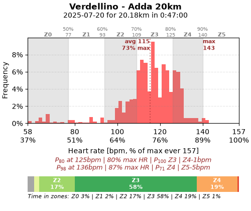
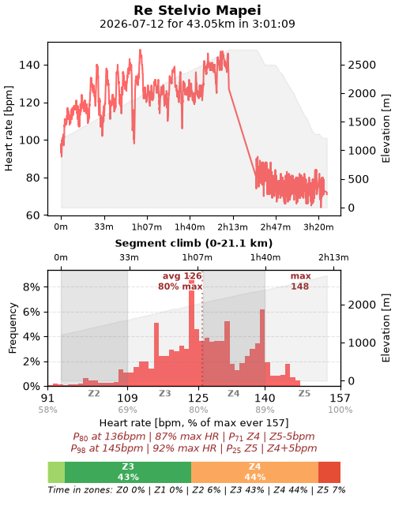
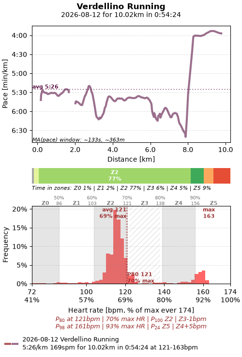
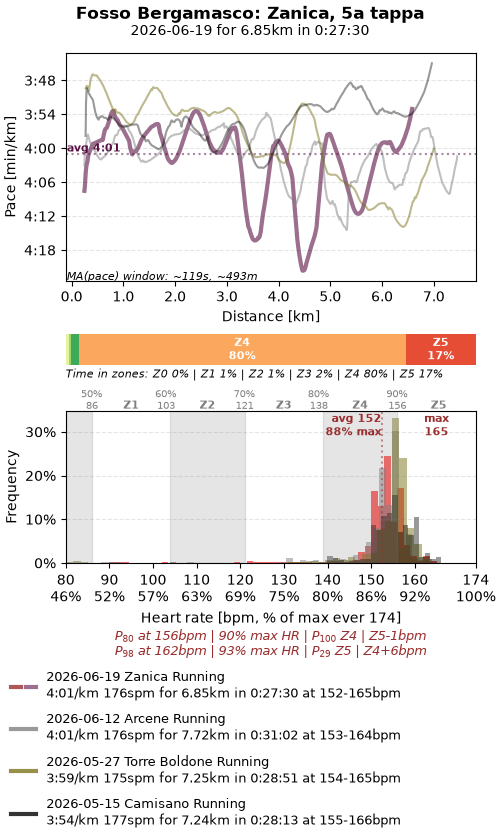
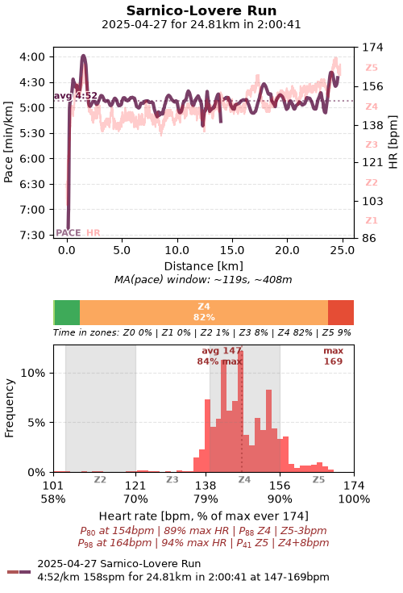
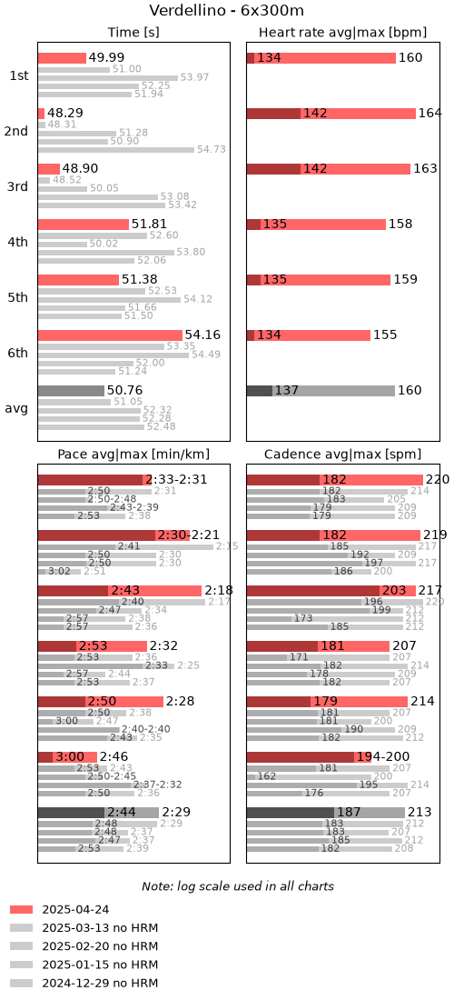
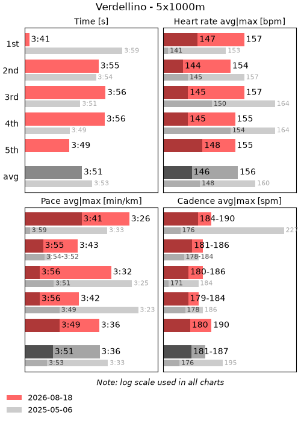
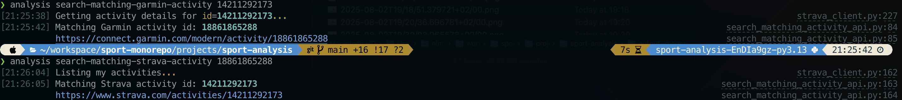
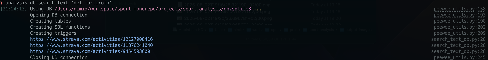
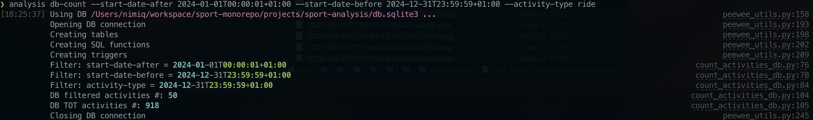

**Sport monorepo: Sport Analysis**
==================================

A CLI to help analyze sport data collected from Garmin Connect and Strava.


Usage
=====

---

```sh
$ san --help
Usage: san [OPTIONS] COMMAND [ARGS]...

  Sport Analysis CLI.

  Docs: https://github.com/puntonim/sport-monorepo/blob/main/projects/sport-analysis/README.md

Options:
  --help  Show this message and exit.

Commands:
  db-count                        Count activities in the DB; eg.
  ...
```


Ride (bike)
-----------

### Simple ride (Garmin api)
```sh
$ san plot-simple-ride 19795436851 --title "Verdellino - Adda 20km" --figure-size 5.0 6.5 -d ~/output-images/
```


### Climb ride (Garmin api)
Optionally pass a segment, by its start-end distance or Strava segment name, to limit
 the bottom HR histogram to the segment only. 
```sh
$ san plot-climb-ride 19792668968 --title "Re Stelvio Mapei" --segment-start-meters 0 --segment-end-meters 21110 --segment-title "Climb segment only" --figure-size 5.0 6.5 -d ~/output-images/
```



Run
---

### Simple run (Garmin api)
Optionally compare with previous runs.
```sh
$ san plot-10km-run 19005790234 -vs 19074660632 --title "Fosso BG" --figure-size 5.0 6.5 --pace-plot-set-y-axis-bottom-to-slowest-pace-perc 3.5 -d ~/output-images/
```




### 300 m interval run (api)
```sh
Optionally compare with previous 2 runs automatically found.
$ san plot-interval-run 18923007987 --dist 300 -n-int 6 --vs-n 2 --text "6x300m" --title "6x300m a Verdellino" --figure-size 5.0 8.2 -d ~/output-images/
```


### 1000 m interval run (api)
```sh
$ san plot-interval-run 19042748874 --dist 1000 -n-int 5 --vs-n 1 --text "4x1000m" --title "4x1000m a Verdellino" --figure-size 5.0 8.2 -d ~/output-images/
```



Search
------

### Search matching Strava or Garmin activity (api)
```sh
$ san search-matching-garmin-activity 14211292173
$ san search-matching-strava-activity 18861865288
```



### Search text (db)
```sh
$ san db-search-text 'del mortirolo'
```



Count
-----

### Count activities (db)
```sh
$ san db-count --start-date-after 2024-01-01T00:00:01+01:00 --start-date-before 2024-12-31T23:59:59+01:00 --activity-type ride
```



Copyright
=========

---

Copyright puntonim (https://github.com/puntonim). No License.
