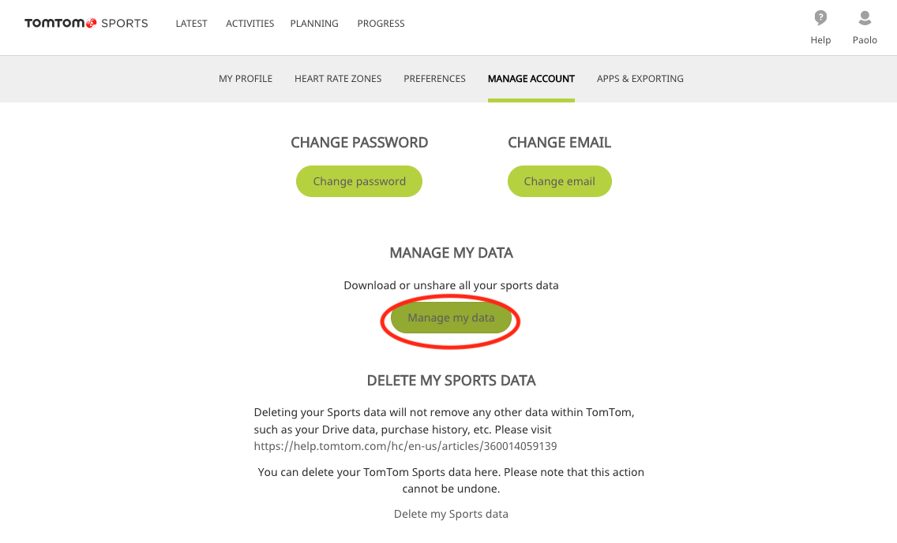
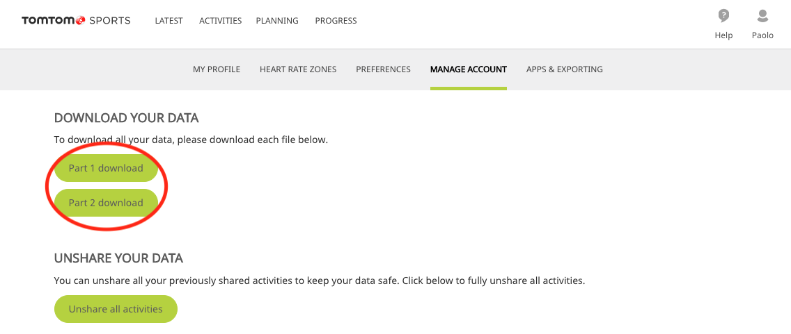
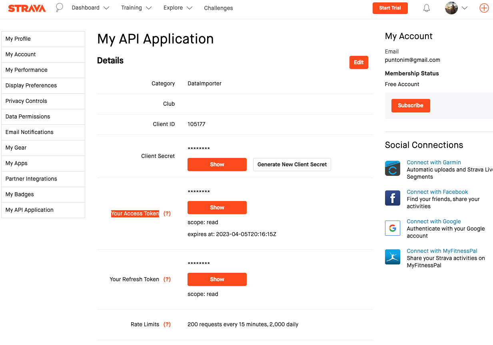

**Sport monorepo: Strava Importer from TomTom Sports**
======================================================

This basic script helps importing into Strava the activity manually exported from
 TomTom Sports website.

You need to manually export all data from TomTom Sports and save them in the
 dir `./data-from-tomtom-sports`. And then run this script.


## Export activities from TomTom Sports

Connect the TomTom watch to the computer and open the TomTom Sports website.\
You can download all your activity:\
    Paolo > Settings > MANAGE ACCOUNT > Manage my data\
See screeshots:



Extract the 2 zip files and move all the *.gpx files into the dir `./data-from-tomtom-sports`.


## Create API in Strava

To get API keys you need to create and API App in Strava.\
Note that you can create only 1 app.\
Go to: [https://www.strava.com/settings/api]()
and create a new API.\
Take note of the `client_id` and `client_secret`.\
The importer will guide you to get a valid access token.\
Also note that the access token in that page ("Your Access Token") is NOT what you need here because it has a read-only scope.\
See screeshots:



## Installation

```sh
$ python3 -m venv venv
$ source venv/bin/activate
$ pip install -r requirements.txt
```


## Execution

```sh
$ python importer.py
```
The first time use the `client_id` and `client_secret` of your Strava API app to get an access token.
In the next runs you can reuse the same access token.

Note that all the activities are **public** as you cannot set the privacy mode using APIs.
I edited the privacy mode MANUALLY one by one ;P


## Strava API docs

 - Authentication: https://developers.strava.com/docs/authentication/
 - API: https://developers.strava.com/docs/reference/#api-Uploads-createUpload
 - Upload activity: https://developers.strava.com/docs/uploads/


## Copyright

Copyright puntonim (https://github.com/puntonim). No License.
